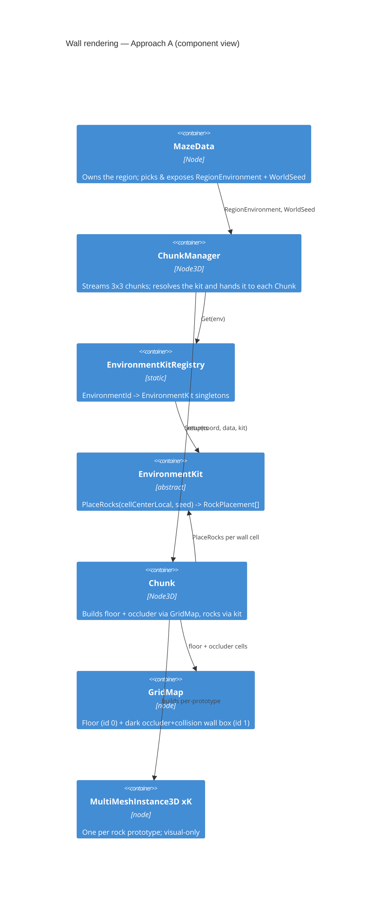
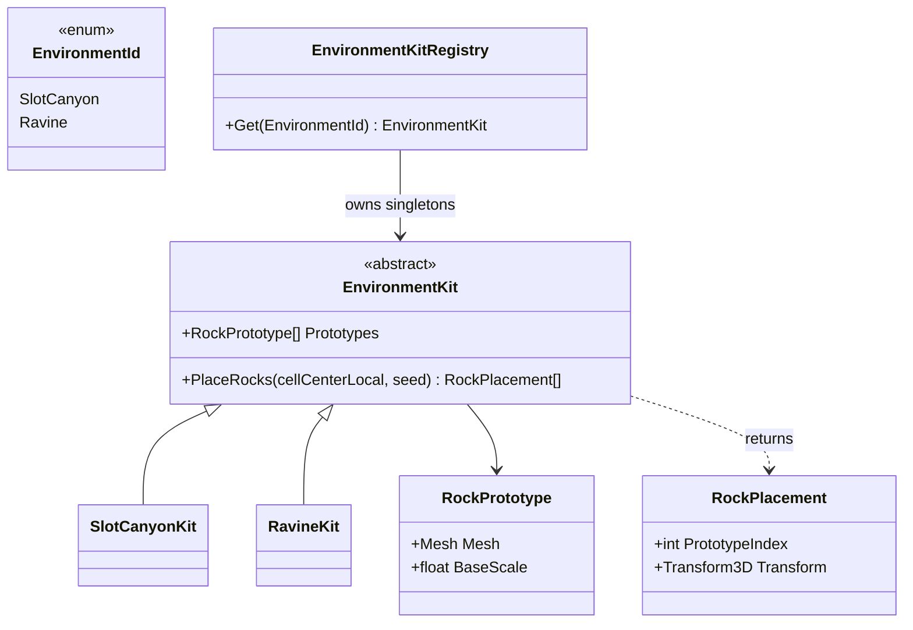
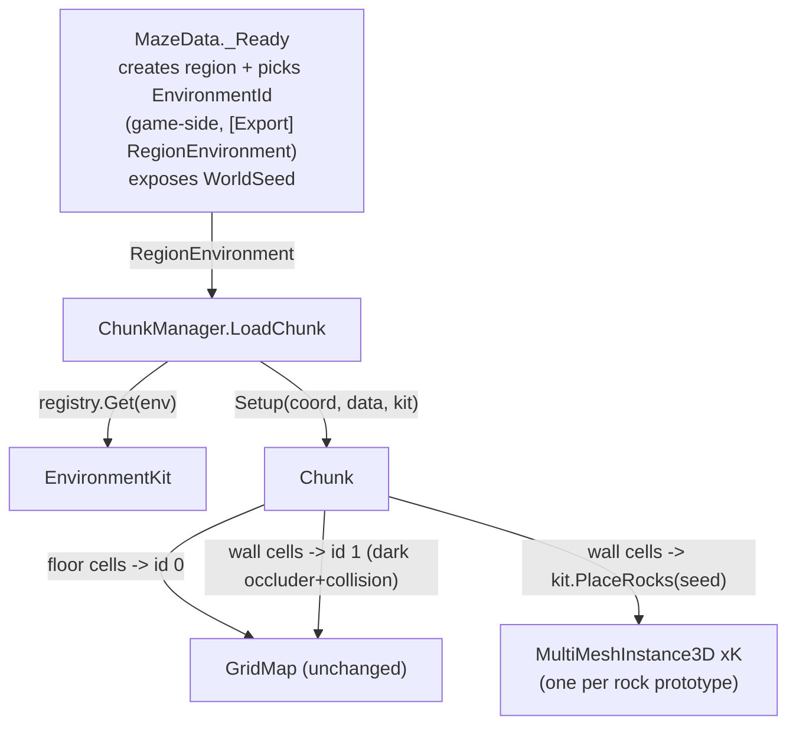

# Environment Kits — Rock-Wall Rendering Design

- **Date:** 2026-07-07
- **Status:** Approved design (pre-implementation)
- **Branch:** `docs/environment-diversity-brainstorm`
- **Next step:** implementation plan (writing-plans skill)

## 1. Problem & goal

Today a wall is a single `BoxMesh` (3.66 × 30 × 3.66), instanced identically per cell
via GridMap (`MazeTiles.tres` MeshLibrary item 1), wearing a `FastNoiseLite`
normal-map `StandardMaterial3D`. A normal map only re-angles lighting on a flat
plane — it **cannot change a silhouette**. So every wall edge stays a straight box
line and every corner is a hard 90°, which reads as "castle / room corner," not
natural canyon rock.

**Goal:** make walls look like natural intersecting canyon rock, and do it through
an abstraction that generalizes to *many* per-region environments in a future
endless world — not a one-off canyon hack.

## 2. Scope

**In scope**
- Replace the *visible* wall surface with kit-driven **instanced rock geometry**
  (`MultiMeshInstance3D`).
- A game-side **environment-kit** abstraction, selectable per region, with two
  concrete kits: **SlotCanyon** and **Ravine**.
- Single region (as today). Environment chosen game-side at region creation,
  exposed as an `[Export]` for easy A/B testing.
- Rock meshes sourced from Arnklit's **Godot Cliffs & Rocks Pack 1**, version
  **`v1_02` (non-HighRes)** — latest and lighter than the `_HighRes` variants.
  The pack ships 8 cliffs, 6 boulders, 4 rocks, 2 piles, plus rock materials and a
  triplanar `advanced_rock.gdshader` we reuse.

**Out of scope (границы)**
- Multi-region streaming / endless world / biome-selection strategy — **seam left,
  not built.**
- Extending maze-gen with a biome field — environment stays **game-side**.
- Floor / sky / fog / lighting per biome — **walls only**.
- Bespoke per-biome rock art — kits differ by **parameters over shared meshes**
  initially.
- Voxel / marching-cubes / SDF geometry, parallax-occlusion mapping, and vertex
  displacement — evaluated during research, **not chosen** (see Appendix).

## 3. Context from maze-gen (why environment is game-side)

- `world.GetOrCreate(address, recipe)` takes a `RegionRecipe`, which describes
  **structure** (algorithm / fill / cell shape / rooms; presets `Maze`,
  `Corridors`, `Dungeon`, `Caverns`). It has **no visual-environment field**.
- `RegionCell` exposes `.Type` (`AreaType`) and `.Tags` (documented as usable by
  the game "to pick tiles, styles, or behaviours"), but `AreaType` is reported
  uniformly as `Environment` for wall cells today; per-cell room/cave typing is a
  documented **future maze-gen enhancement** behind that same surface.
- **Decision:** environment is a **game-side** concept, assigned per region at
  creation time; maze-gen is untouched. When maze-gen later gains biome typing,
  the game can derive `EnvironmentId` from it **without changing kit or chunk
  code**.

## 4. Architecture (Approach A)

Keep GridMap as the **collision + occluder backbone**; add kit-driven rock
MultiMeshes **on top**. This isolates the volatile new part (rock instancing) from
the stable part (collision, occlusion, chunk streaming) — you can iterate on rock
kits without touching the code that keeps the player from falling through walls or
seeing into the void.

## 5. Environment-kit abstraction

- **Contract:** `PlaceRocks(Vector3 cellCenterLocal, ulong seed) -> RockPlacement[]`.
  The kit decides how many rocks, which prototypes, and their rotation / scale /
  vertical-jitter / protrusion. That is the *only* place SlotCanyon and Ravine
  differ.
- **Prototypes are loaded once** into the registry singletons, not per chunk.
- **Two kits, concrete prototypes from the pack:**
  - **SlotCanyon** — the 8 `Cliff*` meshes (tall, near-vertical) as the primary
    prototypes, optionally `Rock1–4` at the base; tight; high vertical coverage;
    low horizontal jitter → fluted slot-canyon look.
  - **Ravine** — `Boulder1–6` + `Rock1–4` (chunky, rounded); more tilt; wider
    horizontal spread; varied heights → broken open-ravine look.
  Two visibly different biomes for near-zero art cost — the difference is the
  prototype subset + tuning, over the same shared pack.
- **Feed MultiMesh the bare `Mesh`, not the prefab.** Use the pack's
  `Models/meshes/Cliff_models_*_mesh.res` mesh resources — a MultiMesh draws N
  transforms of a single `Mesh`, so the `Prefabs/*.tscn` node/collision wrapping is
  exactly what the visual-only rocks must not carry.

## 6. Data flow (region → kit → chunk)

- `MazeData` gains an `[Export] EnvironmentId RegionEnvironment` (flip it in the
  editor to A/B SlotCanyon vs Ravine — the seam for a future
  `regionAddress -> EnvironmentId` map) and exposes `WorldSeed`.
- `ChunkManager` resolves the kit and passes it to `Chunk.Setup`.
- `Chunk` builds floors (GridMap id 0), wall occluder+collision boxes (GridMap
  id 1, restyled dark), and wall rocks (kit → per-prototype MultiMeshes).
- Nothing reads/writes `IsFloor`, pathfinding, minimap, or collision differently —
  they all keep seeing the cell grid.

## 7. Chunk build details

- **Determinism:** each wall cell seeds from its **world coordinate**:
  `seed = hash(WorldSeed, wx, wz)`. A cell's rocks are identical regardless of which
  chunk streams it in, and stable across unload/reload — no flicker.
- **Batching:** while iterating wall cells, `Chunk` buckets each `RockPlacement`
  into a per-prototype transform list, then builds **one `MultiMeshInstance3D` per
  prototype** (≤ K per chunk). A 3×3 grid with K≈5 → ~45 draw calls for *all* rock
  walls — the reason this is affordable.
- **Occluder + collision:** the GridMap wall box stays, doing two jobs —
  **collision** (unchanged `BoxShape3D`) and **opacity** (plain dark material,
  since rocks now cover the surface). Guarantees no see-through / light-leak through
  gaps between rocks.
- **Rocks are visual-only** (MultiMesh has no collision); they overhang into the
  corridor freely because collision is the box and the corridor is 6× player width.
- **Rock material:** reuse the pack's `Cliff_Material_*.tres` +
  `advanced_rock.gdshader` (already triplanar with anti-tiling) applied to the
  MultiMeshes — no custom material authored. Per-kit material choice (e.g. Grey vs
  Red rock per biome) is a cheap future seam.
- **Coordinates:** rock transforms are in **chunk-local** space; the seed uses
  **world** cell coords.

## 8. Extensibility seam

Adding a future biome (ice cave, brick dungeon, forest…) is three local edits:
1. Add an `EnvironmentId` value.
2. Add an `EnvironmentKit` subclass (its prototypes + params).
3. Register it in `EnvironmentKitRegistry`.

**No changes** to `Chunk`, `ChunkManager`, or `MazeData` logic. When multi-region
streaming lands, `MazeData` swaps its single `RegionEnvironment` export for a
`regionAddress -> EnvironmentId` map — kits and chunk code untouched.

## 9. Verification (no GUI needed; CLI per CLAUDE.md)

- **Build:** `dotnet build`.
- **Headless logic check:** `GD.Print` the active kit name, wall-cell count, and
  total rock-instance count; grep the headless run. Confirms placement +
  determinism.
- **Visual check:** `DISPLAY=:0` screenshot for both `SlotCanyon` and `Ravine`
  (flip the export), eyeball the silhouette, then delete the temp screenshot code.
- **Perf sanity:** watch draw-call / tri count in a throwaway prototype and tune
  density.

## 10. Risks

- **Perf vs. density** — empirical; validate with a prototype. MultiMesh batching is
  the primary mitigation. The pack's `Cliff*` meshes are **high-poly**
  (photoscan-grade, ~130–210 KB each), so keep **few cliff instances per wall cell**
  and standardize on the **non-HighRes** pack; consider decimated LOD meshes if the
  tri budget bites.
- **Coverage gaps at 30 height** — rely on the dark occluder box for opacity; ensure
  prototype heights/density actually cover a 30-tall wall (tall column prototypes).
- **Repetition with few meshes** — killed by rotation + non-uniform scale + vertical
  jitter, not by mesh count.
- **Rock-pack import/licensing** — verify the chosen `.glb` pack imports cleanly and
  is license-clear for the project.

## 11. Docs to update at implementation time (mandatory per project rules)

- New `requirements/REQ-NNNN-environment-kits/` feature folder (Russian WHAT facets
  + README + `design.md` HOW with границы).
- `requirements/TECH_SPEC.md` — maze-geometry/rendering: GridMap wall is now a dark
  occluder+collision box; visible rock is kit-driven MultiMesh.
- `CLAUDE.md` + `AGENTS.md` — architecture (wall rendering) + art pipeline (rock
  pack) sections, kept in sync.
- `requirements/README.md` registry row + status.
- Keybindings: unchanged (no input change).

## Appendix — research references

Technique survey that led to the "instanced intersecting rocks" choice:

- Silhouette-rocks technique (flat face + modeled silhouette rocks):
  [polycount — Making stone walls methods](https://polycount.com/discussion/210916/making-stone-walls-methods)
- Corner handling on modular walls:
  [polycount — modular walls, corners](https://polycount.com/discussion/232991/creating-modular-walls-with-thickness-how-to-handle-corners-and-alignment)
- Cliff-pack planning (references Uncharted 3 / The Last of Us breakdowns):
  [polycount — how to plan cliff packs](https://polycount.com/discussion/235383/how-to-plan-cliff-packs-for-game-environments-any-good-references-or-breakdowns-for-other-games)
- Rock meshes for the prototype:
  [Arnklit Godot Cliffs & Rocks pack](https://arnklit.itch.io/godot-rock-asset-pack1)
- MultiMesh instancing / GridMap variant gap:
  [Godot GridMap docs](https://docs.godotengine.org/en/stable/tutorials/3d/using_gridmaps.html),
  [rotation/variant proposal](https://github.com/godotengine/godot-proposals/issues/3716)

Alternatives considered and deferred (with rationale in §2 Out of scope):

- Parallax occlusion mapping —
  [POM w/ self-shadowing](https://godotshaders.com/shader/parallax-occlusion-mapping-with-self-shadowing/)
  (can't change silhouette; fails at grazing angles).
- Vertex displacement —
  [Godot vertex displacement docs](https://docs.godotengine.org/en/stable/tutorials/3d/vertex_displacement_with_shaders.html)
  (no GPU tessellation in Godot 4; pre-subdivision cost).
- Voxel / marching-cubes / SDF —
  [Zylann godot_voxel](https://github.com/Zylann/godot_voxel)
  (renderer swap; overkill for a grid maze; how Deep Rock Galactic does free-form
  caves).
- Stochastic / hex-tiling triplanar (anti-repeat on the face) —
  [stochastic terrain shader](https://godotshaders.com/shader/triplanar-stochastic-terrain-shader/)
  (~30–35% perf drop; a future face-polish seam).
